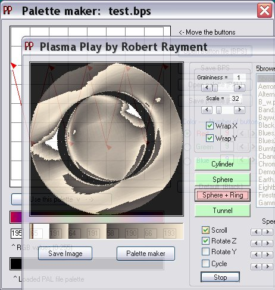

<div align="center">

## Plasma Play


</div>

### Description

Plasma Play by Robert Rayment. Just playing with plasmas &amp; palettes, if you like that kind of thing. Only tested on WinXP, should be OK elsewhere. If you have trouble with the manifest file then rename or delete it. Zip 60KB.
 
### More Info
 
Palette

Just run

Pictures


<span>             |<span>
---                |---
**Submitted On**   |2006-06-14 09:17:54
**By**             |[Robert Rayment](https://github.com/Planet-Source-Code/PSCIndex/blob/master/ByAuthor/robert-rayment.md)
**Level**          |Intermediate
**User Rating**    |5.0 (55 globes from 11 users)
**Compatibility**  |VB 6\.0
**Category**       |[Graphics](https://github.com/Planet-Source-Code/PSCIndex/blob/master/ByCategory/graphics__1-46.md)
**World**          |[Visual Basic](https://github.com/Planet-Source-Code/PSCIndex/blob/master/ByWorld/visual-basic.md)
**Archive File**   |[Plasma\_Pla2000846142006\.zip](https://github.com/Planet-Source-Code/robert-rayment-plasma-play__1-65663/archive/master.zip)

### API Declarations

```
Some manifest API - can be ignored.
SetDIBits + Types - for blitting arrays
CopyMemory - for scrolling
Sleep - for reducing CPU usage
```


